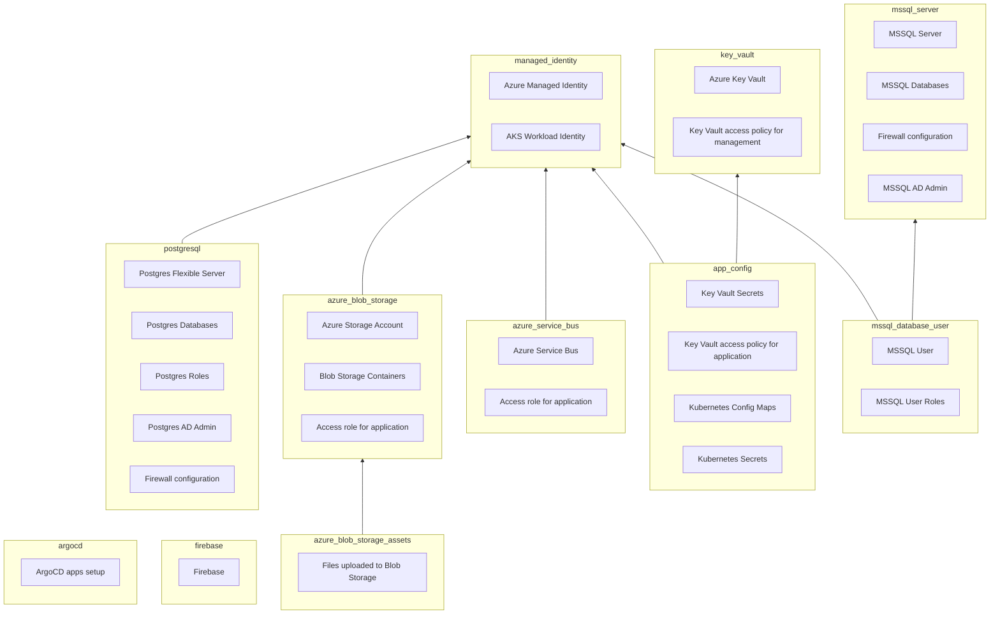

# Terraform common modules

- [app_config](./app_config/readme.md)
- [argocd_app](,/argocd_app)
- [azure_blob_storage](./azure_blob_storage/readme.md)
- [azure_blob_storage_assets](./azure_blob_storage_assets/readme.md)
- [azure_service_bus](./azure_service_bus/readme.md)
- [firebase](./firebase/readme.md)
- [key_vault](./key_vault/readme.md)
- [managed_identity](./managed_identity/readme.md)
- [mssql_database_user](./mssql_database_user/)
- [mssql_server](./mssql_server/)
- [posgresql](/postgresql/readme.md)
- [tags](./tags/readme.md)

<!-- BEGIN_TF_DOCS -->

<!-- END_TF_DOCS -->

## Warnings

#### Creating resource groups and using Azure modules in the same project

Azure modules (`azure_blob_storage`, `azure_service_bus`, `key_vault`) read resource group as a data source. Because `azurerm_resource_group.name` is known _before_ apply, data sources will fail if the resource group is not yet created. You need to partially apply the resource group or pass it as `depends_on`. See the [example](example/service_bus.tf).

#### Using `mssql_server` and `mssql_database_user` modules in the same project

MSSQL provider requires the database to be create _before_ plan. You have to use partial apply to create the database first.

#### Creating AD users in `postgresql` module

Terraform cannot create an AD user for Postgres. Instead it generates a script to be applied on the database. More details in the [module readme](postgresql/readme.md).

## Modules relationships

A birds eye view of what is managed by a module and how they would typically interact with each other. For brevity, it ignores the fact that eventually all the modules have outputs that will be stored in `app_config` (connection strings, access keys, etc).

